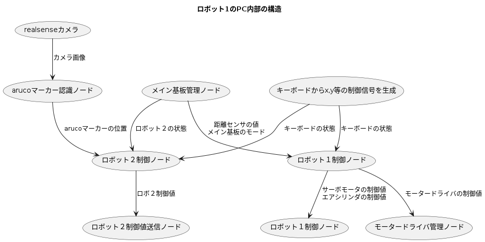

# docs
開発者は、完成版の場所はすべて目を通してください
随時更新されていくため、時々確認しましょう

## 構造
- [全体](all_system.md)
- [ロボット1](robot1_system.md)
- [ロボット2](robot2_system.md)

## ノード

- [キーボードからx,y等の操縦信号を生成](node/key_to_motion.md)
- [ロボット１制御ノード](node/robot1_core.md)
- [ロボット２制御ノード](node/robot2_core.md)
- [モータードライバ管理ノード](node/htmd_manager.md)
- [サーボモーター管理ノード](node/servo_driver.md)
- [空気シリンダ管理ノード](node/solenoid_driver.md)
- [realsense](node/realsense.md)
- [arucoマーカー認識ノード](node/aruco_detector.md)
- [ロボット１経路生成ノード](node/navi1.md)
- [ロボット２経路生成ノード](node/navi2.md)
- [ボール検出ノード](node/ball_detector.md)
- [箱検出ノード](node/box_detector.md)
- [ロボット２自動投擲ノード](node/auto_throw.md)
- [ロボット１のメイン基板と通信するノード](node/robot1_communication.md)
- [ロボット２のメイン基板と通信するノード](node/robot2_communication.md)

## 基板
- HTMDv2.2c
- HTMDv2.2s
- [ロボット１のメイン基板](robot1_mainboard.md)
- [ロボット２のメイン基板](robot2_mainboard.md)
- [YamaHexDeviceController](yama_hex_device_controller.md)

## 通信
- [CAN通信](can_communication.md)
- [UDP通信](udp_communication.md)